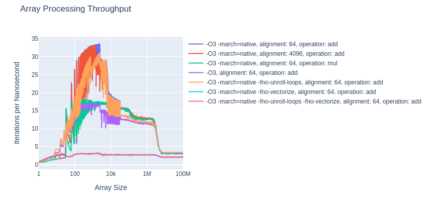

# Throughput Analysis

With this repo I tried to get a better intuition for what the maximum possible throughput is when performing a simple operation on an array.

The benchmark is designed so that it is cpu or memory bandwidth bound. That is instead of e.g. memory access latency or branch prediction, which I already investigated in the past:
* https://dev.to/jacqueslucke/a-c-micro-optimization-exercise-3p65
* https://github.com/JacquesLucke/iteration_analysis
* https://github.com/JacquesLucke/cache_latency_analysis

The following aspects are varied between different benchmarks in this project:
* Array size that is processed repeatedly.
* Compiler flags.
* Alignment of the processed arrays.
* Operation that is performed (current only `add` and `multiply` is used).

* `benchmark_functions.cc` contains the functions that are measured.
* `record.py` does the following things:
    * Compiles the c++ code with different compiler flags.
    * Initiates the benchmark for different array sizes.
    * Caches the benchmark results in `.csv` files in the `results` directory.
    * Generates interactive graphs that can be viewed in a webbrowser.
* Even though the benchmarked functions are very simple, the resulting graphs are surprisingly complex. Many performance related aspects of modern CPUs are required to make sense of the results:
    * Different L1, L2 and L3 cache sizes with different bandwidths (see overall structure of the graph).
    * Loop unrolling and vectorization done by the compiler (see 1 - 2k in the graph).
    * Something probably related to page sizes which I can't fully explain yet (see 10k - 30k in the graph).

Note, changes at the 30k mark are most likely caused by a change sampling strategy at that point. Needs further investigation.

Interactive versions of the graph:
* Log X Scale: http://htmlpreview.github.io/?https://github.com/JacquesLucke/throughput_analysis/blob/main/results/graph_log.html
* Linear X Scale: http://htmlpreview.github.io/?https://github.com/JacquesLucke/throughput_analysis/blob/main/results/graph_linear.html

External Dependencies:
* Clang to compile C++17 code.
* Python 3.9+ with plotly.
